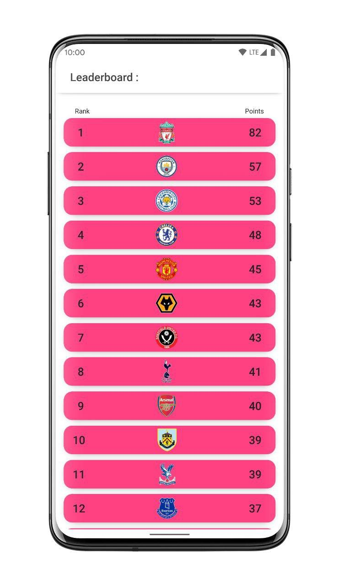

# Arena
An Android App to stay updated on your favorite team's score, upcoming matches and the league table. Built using [Flutter](https://flutter.dev/).

## Prerequisites
* Android 4.1 (or above)

## Features

* Leaderboards and Team Select
  * Check team rankings
  * Check points in current Season
  * Click to see team's detailed stats
 

* Team Stats Page
  * See Detailed Stats
    * Matches Played
    * Matches Won
    * Matches Drawn
    * Goals Scored Per Match Ratio
    * Goals Conceded Per Match Ratio
    * Upcoming Match
   
  
## Download
* Download and install the [APK](https://github.com/mihirs16/Arena/raw/master/S.W.A.T/App/apk_dist/arena.apk) for Android.
* May ask for permission to [Install From Unknown Source](https://www.verizon.com/support/knowledge-base-222186/).
  

